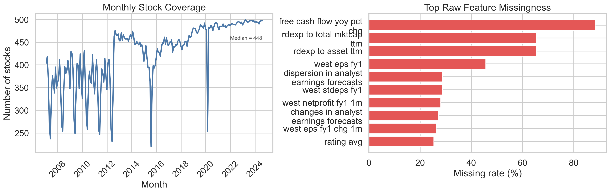
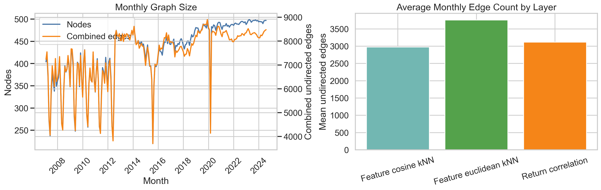
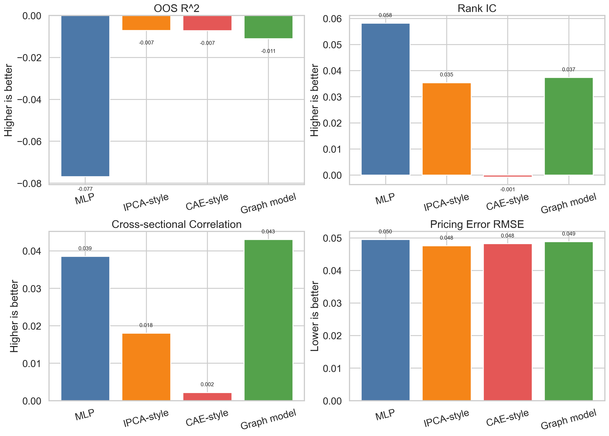
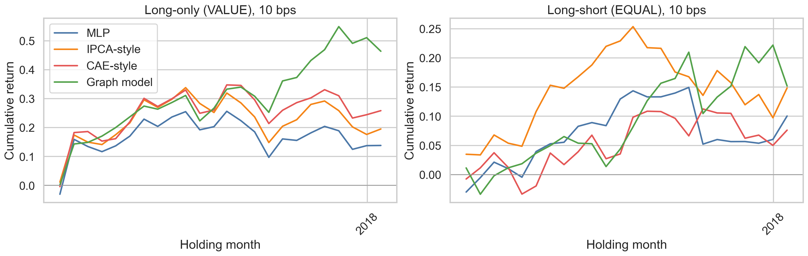
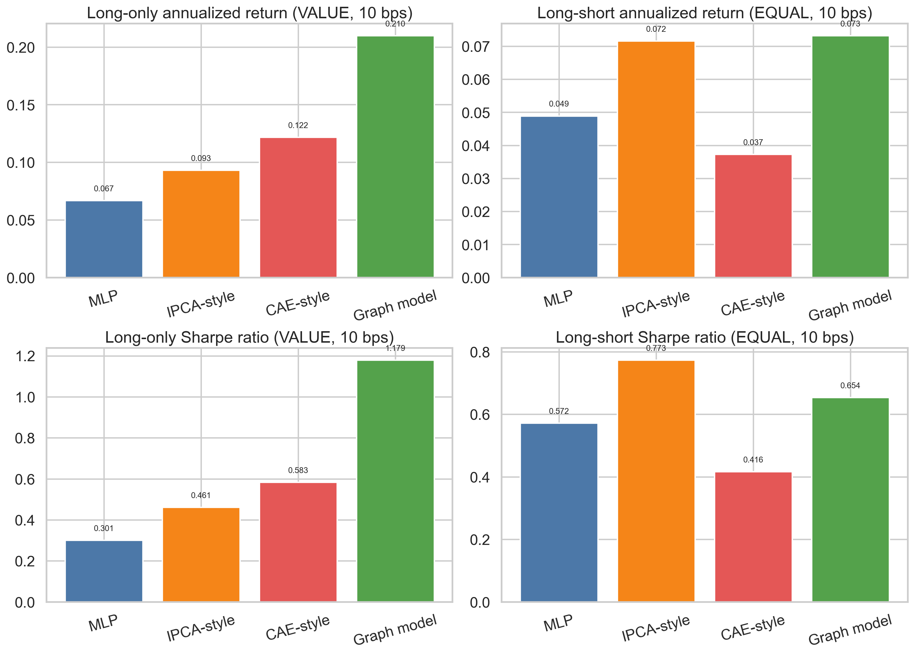
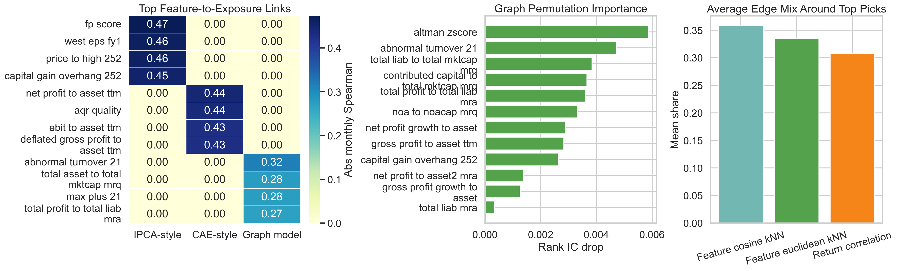
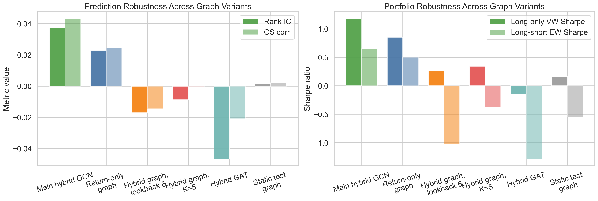
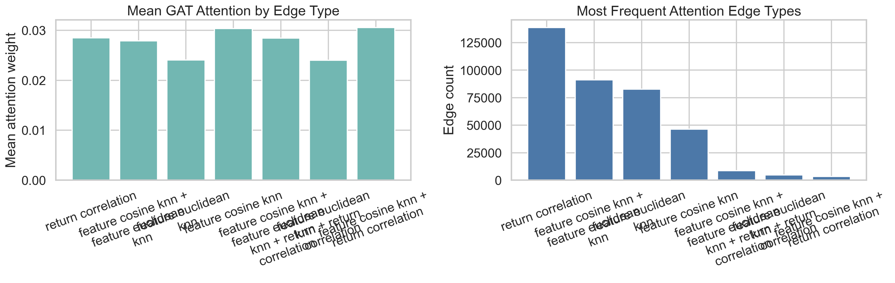

# Graph-Enhanced Conditional Latent Factor Pricing

## Out-of-Sample Evidence from the Chinese Equity Cross-Section

Course: MFE5340 AI in Financial Engineering  
Project integration draft: Stage 1 to Stage 8  
Report language: English draft  
Author(s): __________  
Submission note: This document consolidates the project protocol, stage reports, result tables, and report figures into a single final-report draft. For a two-person group, section-level author labels can be filled in before submission.

## Abstract

This project studies whether explicitly modeling stock-to-stock relationships can improve conditional latent factor pricing in the Chinese equity cross-section. The central question is not whether a graph neural network can act as a black-box return predictor, but whether graph context can improve the estimation of time-varying factor exposures and thereby deliver better out-of-sample pricing, prediction, and portfolio performance than characteristic-only alternatives. To answer this question, the project first constructs a point-in-time monthly panel based on the `features500` characteristic universe, the CSI 500 membership mask, monthly stock returns, market capitalization, the risk-free rate, and trading-feasibility flags. It then implements three non-graph benchmarks: a direct return-prediction MLP, a linear IPCA-style conditional latent factor model, and a nonlinear conditional autoencoder-style latent factor model. On top of these baselines, the project builds a dynamic hybrid stock similarity graph and trains a graph-enhanced conditional latent factor model.

Under the default main specification, all models are compared on the same aligned 24-month out-of-sample window. The evidence suggests that graph structure adds incremental value, but not an all-metric victory. The graph model achieves a mean rank IC of 0.0374 and a mean cross-sectional correlation of 0.0431, outperforming the characteristic-only nonlinear latent benchmark on ranking-oriented metrics. Its clearest economic contribution appears in the long-only portfolio tests, where the long-only value-weight strategy delivers an annualized return of 20.98% and a Sharpe ratio of 1.1794 at the main 10 bps cost setting. At the same time, the IPCA-style model remains competitive on OOS R^2 and long-short Sharpe, while the MLP delivers the highest rank IC but lacks a latent-factor asset-pricing interpretation. Overall, the most defensible conclusion is that graph context meaningfully improves cross-sectional ordering and implementable economic value within an asset-pricing-oriented framework, even though it does not dominate every benchmark on every metric.

## Keywords

Graph neural networks; asset pricing; conditional latent factor models; Chinese equity market; out-of-sample testing; portfolio construction; interpretability

## 1. Introduction

Section author: __________

One of the main promises of machine learning in quantitative investment is that it can exploit nonlinear structure in high-dimensional firm characteristics and improve out-of-sample performance relative to traditional linear factor models. Yet many cross-sectional stock prediction frameworks still treat each stock as an independent observation. In practice, this assumption is too restrictive. Stocks move together through industry linkages, style co-movement, liquidity spillovers, common ownership, and crowded trading. If such dependence is economically meaningful, then a model that only looks at each stock in isolation may miss part of the information relevant for time-varying risk exposures.

This project therefore focuses on a more asset-pricing-oriented question: can graph structure improve conditional latent factor models by enhancing the exposure function rather than by replacing it with a purely black-box predictor? Instead of asking whether a graph model can forecast returns directly, the project asks whether graph context can sharpen the mapping from stock characteristics to conditional betas, and whether that improvement translates into better out-of-sample prediction diagnostics, better pricing diagnostics, and stronger portfolio performance.

The project makes four contributions. First, it builds a unified point-in-time monthly panel from the provided Chinese equity dataset, including returns, risk-free rates, market capitalization, CSI 500 membership, and trading-feasibility filters. Second, it implements a layered benchmark design that cleanly separates gains from generic nonlinearity, gains from latent-factor structure, and gains from graph context. Third, it evaluates models not only through prediction metrics, but also through long-short and long-only portfolio tests, which are explicitly required by the course guideline. Fourth, it adds interpretability and robustness diagnostics so that the final conclusion is not limited to whether the graph model "wins," but also addresses how and where it appears to add value.

## 2. Related Literature and Project Positioning

Section author: __________

The project sits at the intersection of conditional asset pricing, machine-learning-based return modeling, and graph-based representation learning. The first relevant literature stream is Instrumented PCA (IPCA), which shows that firm characteristics can serve as instruments for time-varying factor loadings. This framework is especially important because it reframes firm characteristics as inputs to dynamic exposure estimation rather than as direct return predictors. The second stream is the conditional autoencoder and related deep asset-pricing literature, which demonstrates that the mapping from characteristics to conditional betas need not be linear. The third stream is the latent-factor pricing literature that emphasizes economic targets, such as pricing error minimization, instead of focusing exclusively on statistical variance decomposition. The fourth stream is the emerging graph-finance literature, which brings stock interaction structure into prediction and pricing models.

Despite this progress, two gaps remain. First, many graph-based finance papers focus on return prediction, but do not explicitly formulate graph information as an input to conditional beta estimation. Second, many conditional latent factor models remain characteristic-only models, meaning they do not directly encode cross-sectional stock relationships. This project addresses both gaps by embedding graph context inside the exposure function of a latent factor pricing system.

Put differently, the goal here is not to prove that "GNNs predict stock returns better." The goal is to test whether graph context improves conditional exposure learning enough to matter for out-of-sample pricing and portfolio construction. This positioning is important because it determines the architecture used later: the graph model outputs exposures, not just return scores.

## 3. Data, Sample Construction, and Feature Engineering

Section author: __________

The project uses the course-provided local dataset. The main inputs are monthly stock returns from `monthly_returns.pkl`, monthly market capitalization from `mcap.pkl`, a daily risk-free series from `risk_free.csv`, daily blacklist and untradable flags from `BLACKLIST.pkl` and `UNTRADABLE.pkl`, the monthly CSI 500 mask from `csi500_mask_monthly.pkl`, and a large library of precomputed monthly firm characteristics stored in wide-format `.pkl` files. The main specification uses `features500/`, which is consistent with the CSI 500 universe and helps control computational complexity.

Before any model is trained, the project performs a substantial Stage 2 preprocessing step. This step does not primarily invent new handcrafted factors from raw price data. Instead, it assembles a unified, model-ready characteristic matrix from the stored feature files, applies the CSI 500 filter at month `t`, aligns month-`t` characteristics with month-`t+1` realized returns, compounds the daily risk-free rate into a monthly `rf_next_month`, constructs next-month excess returns, aggregates daily blacklist and untradable records to month-level feasibility flags, and then applies cross-sectional cleaning. The cleaning routine includes winsorization at the 1st and 99th percentiles by month, median imputation within month, and cross-sectional normalization to mean zero and unit standard deviation.

Relative to the guideline's recommendation to conduct feature selection before model training, the implemented feature-selection step is conservative rather than aggressive. Features are dropped only if their post-filter missing fraction exceeds 95%. Under this rule, all 218 raw feature files are retained. This choice is transparent and reproducible, but it also means the project should be interpreted as using a broad cleaned feature set rather than a heavily pruned one.

### Table 1. Main panel summary

| Item | Value |
| --- | ---: |
| Final observations | 90,351 |
| Months | 211 |
| Date span | 2007-01-31 to 2024-07-31 |
| Unique stocks | 1,678 |
| Raw feature files loaded | 218 |
| Features kept | 218 |
| Base CSI 500 stock-month rows | 105,500 |
| After blacklist filter | 104,053 |
| After untradable filter | 90,351 |
| Target | One-month-ahead excess return |



*Figure 1 shows the evolution of sample coverage in the cleaned main-spec panel and the most sparse raw features before cleaning. The figure highlights why careful preprocessing is necessary before any benchmark or graph model is trained.*

Figure 1 makes two points clear. First, the cross-section is large enough each month to support meaningful monthly ranking exercises. Second, some economically interesting feature families, especially analyst- and R&D-related variables, are sparse in raw form. This is exactly why Stage 2 is not a trivial data-loading step, but a substantive part of the research design.

## 4. Methodology

Section author: __________

### 4.1 Out-of-sample protocol

The project uses an expanding-window OOS design. At each refit date, the model is estimated on a historical training window, a trailing validation window is reserved for neural early stopping and model selection, and the model is then used to generate predictions only for the next OOS block. In the default main run, the training window is 96 months, the validation window is 12 months, and the benchmark comparison is limited to 24 aligned OOS months. As a result, the common benchmark-comparison sample spans 2016-01-31 through 2017-12-31. This design preserves point-in-time discipline, but also creates an important limitation: the default OOS horizon is short.

### 4.2 Stage 3 non-graph benchmarks

The first benchmark is a direct MLP predictor:

```text
y_hat_{i,t+1} = h_theta(x_{i,t})
```

This model is included to measure how much predictive power can come from generic nonlinear characteristic-based prediction alone. It does not estimate latent factors or conditional betas.

The second benchmark is the IPCA-style model:

```text
beta_{i,t} = x_{i,t}' Gamma
y_hat_{i,t+1} = beta_{i,t}' f_bar
```

Here, characteristics linearly determine dynamic loadings, and latent factor returns are estimated through a ridge-regularized alternating least squares procedure. OOS prediction uses month-`t` exposures and the historical mean factor premium from the training window.

The third benchmark is the conditional autoencoder-style model:

```text
beta_{i,t} = g_theta(x_{i,t})
y_hat_{i,t+1} = beta_{i,t}' f_bar
```

This model keeps the latent-factor structure but replaces the linear loading map with a nonlinear network. Its role is critical because the graph model should not merely outperform a linear benchmark; it should also be evaluated against a nonlinear characteristic-only latent benchmark.

### 4.3 Stage 4 graph construction

For each month, the project builds a stock graph whose nodes are the stocks available in the cleaned main-spec panel. Node features are the 218 cleaned firm characteristics. Because the stored dataset does not contain point-in-time industry classifications, the main graph does not include industry edges. Instead, it uses a dynamic hybrid similarity graph with three implemented edge layers:

1. Positive return-correlation kNN edges from the trailing 12 monthly returns through month `t`;
2. Feature cosine-similarity kNN edges using month-`t` characteristics;
3. Feature Euclidean kNN edges using normalized month-`t` characteristic vectors.

Typed edges are preserved in the saved artifacts, but the default graph model consumes a homogeneous graph obtained by combining duplicate edges across layers. This is a practical first-pass design rather than a full multi-relation graph system.



*Figure 2 summarizes how the monthly graph evolves over time and how much each edge layer contributes on average. The graph is dynamic by construction rather than a fixed industry map.*

### 4.4 Stage 5 graph-enhanced conditional latent factor model

The core model in this project is not a graph return predictor in the usual sense. It is a graph-enhanced conditional latent factor model in which graph structure enters the exposure function:

```text
beta_{i,t} = g_theta(X_t, G_t)_i
y_hat_{i,t+1} = beta_{i,t}' f_bar
```

The default main result uses a compact two-layer GCN beta encoder. During training, the model learns month-specific latent factor embeddings and reconstructs next-month excess returns with `beta_{i,t}' f_t`. For validation and OOS prediction, it uses the training-window mean latent factor premium. The loss combines reconstruction error, prediction-alignment error, a pricing-error term, and a small beta shrinkage penalty. This is still a simplified first-pass pricing model rather than a full structural no-arbitrage SDF system, but it preserves the key asset-pricing interpretation that the project cares about.

## 5. Evaluation Metrics and Portfolio Design

Section author: __________

The project evaluates models from three complementary angles. First, prediction quality is measured using OOS R^2, mean squared error, rank IC, and cross-sectional correlation. OOS R^2 captures predictive fit relative to a zero benchmark, while rank IC and cross-sectional correlation focus more directly on cross-sectional ordering. Second, pricing quality is assessed through monthly pricing error diagnostics, including average pricing error and pricing-error RMSE. Third, economic value is measured through investable portfolio tests, which are explicitly required by the course guideline.

Portfolio construction follows the standard signal-at-`t`, return-at-`t+1` protocol. At the end of month `t`, model scores are used to sort stocks into top and bottom deciles. The long-short strategy goes long the top decile and short the bottom decile; the long-only strategy holds the top decile only. Both equal-weight and value-weight implementations are reported. Although transaction costs could have been ignored under the course guideline, the project includes 0, 10, and 25 bps settings as a useful sensitivity check. The main report focuses on the 10 bps setting because it is a reasonable compromise between academic simplicity and practical awareness.

## 6. Empirical Results

Section author: __________

### 6.1 Benchmark comparison

The aligned main-sample comparison is summarized in Table 2.

### Table 2. Main OOS benchmark comparison

| Model | OOS R^2 | Rank IC | Cross-sectional corr | Pricing RMSE |
| --- | ---: | ---: | ---: | ---: |
| MLP predictor | -0.0769 | 0.0582 | 0.0385 | 0.0495 |
| IPCA-style | -0.0071 | 0.0354 | 0.0180 | 0.0476 |
| CAE-style | -0.0073 | -0.0008 | 0.0022 | 0.0482 |
| Graph latent factor | -0.0111 | 0.0374 | 0.0431 | 0.0488 |



*Figure 3 visualizes the aligned apples-to-apples benchmark comparison. The graph model does not dominate every metric, but it improves some cross-sectional diagnostics relative to the characteristic-only latent benchmarks.*

Three points stand out. First, compared with the nonlinear characteristic-only latent benchmark, the graph model delivers a clear improvement in rank IC and cross-sectional correlation. This is the strongest direct evidence that graph context improves the exposure function beyond firm characteristics alone. Second, compared with IPCA-style, the graph model is slightly stronger on ranking but weaker on OOS R^2 and pricing RMSE, so the result is incremental rather than decisive. Third, compared with the MLP, the graph model offers a much stronger asset-pricing interpretation and a far better OOS R^2, even though the MLP achieves the highest rank IC. The most balanced reading is therefore that graph structure improves ranking-oriented conditional latent factor learning, but not all metrics simultaneously.

### 6.2 Portfolio performance

The course requires both long-short and long-only portfolio analysis. Table 3 reports the most important main-spec portfolio outcomes at 10 bps: long-only value-weight and long-short equal-weight.

### Table 3. Main portfolio results at 10 bps

| Model | Long-only value ann. return | Long-only value Sharpe | Long-short equal ann. return | Long-short equal Sharpe |
| --- | ---: | ---: | ---: | ---: |
| MLP predictor | 0.0667 | 0.3005 | 0.0489 | 0.5717 |
| IPCA-style | 0.0931 | 0.4611 | 0.0716 | 0.7734 |
| CAE-style | 0.1217 | 0.5834 | 0.0373 | 0.4163 |
| Graph latent factor | 0.2098 | 1.1794 | 0.0732 | 0.6536 |



*Figure 4 shows the cumulative return paths for the main long-only and long-short strategies. The graph model's strongest advantage appears in the long-only implementation.*



*Figure 5 makes it easier to compare annualized returns and Sharpe ratios across models. The graph model is the strongest long-only performer, while IPCA-style remains highly competitive in long-short Sharpe.*

These portfolio results reinforce the interpretation from Stage 6. The graph model appears to be especially useful for improving the quality of top-ranked names, which is exactly what matters most for long-only implementation. However, its advantage is less decisive in the long-short setting, where risk control, turnover, and the behavior of the short leg become more important. In that dimension, the IPCA-style benchmark remains difficult to beat on a risk-adjusted basis.

### 6.3 Interpretability

The guideline explicitly asks for interpretability analysis, including feature importance. The project provides three layers of interpretation. First, it studies the association between learned exposures and raw characteristics. For the graph model, the strongest feature-exposure links include `abnormal_turnover_21`, `total_asset_to_total_mktcap_mrq`, `max_plus_21`, `total_profit_to_total_liab_mra`, and `fp_score`. Second, it runs focused permutation-importance diagnostics for the graph model. The largest rank-IC drops come from permuting `altman_zscore`, `abnormal_turnover_21`, `total_liab_to_total_mktcap_mrq`, `contributed_capital_to_total_mktcap_mrq`, and `total_profit_to_total_liab_mra`. Third, it analyzes graph-neighborhood structure and shows that top-decile graph picks tend to sit in denser graph neighborhoods than the average stock.



*Figure 6 combines feature-exposure heatmaps, graph-model permutation importance, and neighborhood edge-mix diagnostics. The main takeaway is that the graph model is not exploiting graph structure in an arbitrary way; rather, it appears to combine graph context with economically interpretable value, leverage, quality, and trading-activity signals.*

### 6.4 Robustness

To test whether the main result is overly dependent on a single graph design, the project evaluates several close variants: `graph_return_only`, `graph_lookback6`, `graph_latent_k5`, `graph_conditional_latent_factor_static_test_graph`, and `graph_gat_hybrid`. The main summary is shown in Table 4.

### Table 4. Graph robustness summary

| Variant | OOS R^2 | Rank IC | Long-only value Sharpe | Long-short equal Sharpe |
| --- | ---: | ---: | ---: | ---: |
| Graph main diagnostic | -0.0111 | 0.0374 | 1.1794 | 0.6536 |
| Graph return only | -0.0069 | 0.0230 | 0.8576 | 0.5070 |
| Graph lookback6 | -0.0054 | -0.0170 | 0.2669 | -1.0290 |
| Graph latent K=5 | -0.0150 | -0.0087 | 0.3493 | -0.3712 |
| Graph static test graph | -0.0452 | 0.0017 | 0.1649 | -0.5471 |
| Graph GAT hybrid | -0.0115 | -0.0466 | -0.1400 | -1.2869 |



*Figure 7 shows that the default hybrid similarity graph is the most defensible choice in the current implementation. Removing graph layers, shortening the lookback, changing latent dimension, freezing the test graph, or switching to GAT does not improve the main result.*

This section is important because it clarifies that the project's conclusion is not "any graph helps." Instead, it is closer to "the default hybrid graph with a simple GCN encoder works best among the tested first-pass specifications." The GAT variant is particularly informative: a more sophisticated attention-based graph encoder does not outperform the simpler GCN in the current setup, suggesting that model variance and sample length matter.

The project also produces an exploratory GAT attention figure. Because the main Stage 5 result is a GCN result, this figure should be treated as supportive evidence rather than as a basis for the main claim.



*Figure 8 is exploratory only. It summarizes attention patterns in a GAT robustness run and is better suited for an appendix or presentation discussion than for the main empirical claim.*

## 7. Discussion

Section author: __________

Taken together, the results suggest that graph structure adds value mainly by improving cross-sectional ordering and implementable long-only portfolio outcomes. Relative to the CAE-style benchmark, the graph model clearly improves rank-based diagnostics. Relative to IPCA-style, it remains competitive on ranking but not on all statistical pricing metrics. Relative to the MLP, it offers a far more interpretable asset-pricing structure with substantially better OOS R^2, even though it does not match the MLP's top rank-IC score.

This means the most appropriate conclusion is not that the graph model is universally best. Rather, the graph model appears to provide a meaningful but selective improvement inside an asset-pricing-oriented framework. Its strongest benefit is that it helps identify better top-ranked stocks for long-only portfolio formation. That is already economically meaningful, but it is not the same as proving a complete benchmark victory.

This interpretation is also consistent with the difference between the initial proposal and the implemented project. The proposal envisioned a richer design with static industry edges, dynamic similarity edges, and potentially stronger pricing constraints. The implemented project instead adopts a simpler first-pass system: a similarity-only hybrid graph, a compact GCN/GAT encoder, and mean latent-factor forecasting. The resulting evidence should therefore be understood as a solid baseline with supportive results, not as an optimized upper bound on graph-based asset pricing.

## 8. Limitations

Section author: __________

At least five limitations should be emphasized. First, the aligned default OOS window is short, covering only 24 months. This limits the statistical strength of the final comparison. Second, feature selection is conservative: the project filters on extreme missingness but does not perform aggressive feature screening or dimensionality reduction before training. Third, the graph model remains a compact first-pass latent-factor system rather than a stronger no-arbitrage structural model with macro states or dedicated factor forecasting. Fourth, the stored dataset does not contain point-in-time industry labels, so the graph is similarity-based rather than the intended industry-plus-similarity hybrid envisioned in the proposal. Fifth, some Stage 8 interpretability diagnostics rely on a focused rerun because earlier stages did not save all checkpoints by default.

These limitations do not invalidate the main findings, but they do imply that the project should be presented as a well-executed first empirical study rather than as a fully mature research paper with every design choice exhausted.

## 9. Conclusion

Section author: __________

This project develops and evaluates a graph-enhanced conditional latent factor pricing pipeline for the Chinese equity cross-section. Starting from a carefully cleaned monthly panel, it compares characteristic-only benchmarks with a graph-aware latent-factor model under a disciplined out-of-sample protocol, and then evaluates the models through prediction, pricing, and portfolio criteria. The main finding is that graph structure provides meaningful incremental value, especially in rank-based diagnostics and long-only portfolio performance, even though it does not dominate every benchmark on every metric.

The strongest empirical result is the graph model's long-only value-weight portfolio, which achieves an annualized return of 20.98% and a Sharpe ratio of 1.1794 under the main cost setting. This suggests that graph-enhanced exposure learning can improve the quality of top-ranked stocks in an economically relevant way. At the same time, the remaining benchmark competition, especially from IPCA-style in OOS R^2 and long-short Sharpe, shows that the graph advantage is partial rather than universal. The most defensible final answer is therefore that graph context improves conditional latent factor learning in meaningful ways, but further work is needed to turn that incremental advantage into a more decisive all-around improvement.

## References (draft)

Section author: __________

1. Kelly, B., Pruitt, S., and Su, Y. (2019). Instrumented principal component analysis. *Journal of Financial Economics*.
2. Gu, S., Kelly, B., and Xiu, D. (2021). Autoencoder asset pricing models. *Journal of Econometrics*.
3. Lettau, M., and Pelger, M. (2020). Estimating latent asset-pricing factors. *Journal of Econometrics*.
4. Son, H., and Lee, J. (2022). Graph-based multi-factor asset pricing. *Finance Research Letters*.
5. Gu, S., Kelly, B., and Xiu, D. (2020). Empirical asset pricing via machine learning. *Review of Financial Studies*.

Note: Before final submission, the bibliography should be converted into the course-required citation style and aligned with the literature review submitted in Phase 1.

## Appendix: Reproducibility and artifact guide

1. Main report figures are stored under `reports/figures/`.
2. Main summary tables are stored under `outputs/stage8/tables/` and `outputs/portfolio/`.
3. The Stage 2 data report is `reports/data_audit_stage2.md`.
4. The stage-level methodology and result reports are `reports/benchmark_definitions_stage3.md`, `reports/graph_design_stage4.md`, `reports/graph_model_architecture_stage5.md`, `reports/stage6_model_comparison.md`, and `reports/stage7_portfolio_results.md`.
5. For presentation use, Figures 1, 2, 3, 4, 5, and 7 form the clearest main storyline.
